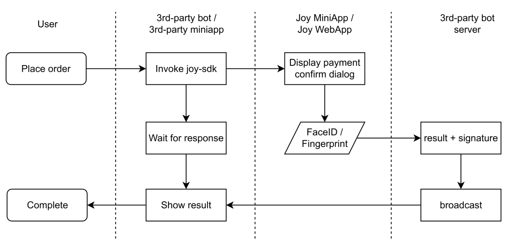

# Telegram Apps Integration

## Introduction

JoyID Wallet now extends its support to Telegram, a messaging app with over 800 million global users who are known for their affinity towards cryptocurrencies and decentralized applications. Integrating with Telegram opens up a world of immense growth potential for your application.

## Challenges with Telegram

While Telegram boasts a vast user base, it comes with inherent limitations, particularly concerning wallet functionalities. Telegram's internal bots and mini-apps restrict certain client side capabilities, such as WebSocket and Passkey, which are essential for comprehensive wallet functionality.

## Innovative JoyID Approach

JoyID has devised an innovative solution that allows users to effortlessly create and utilize a non-custodial wallet within the Telegram ecosystem, bridging the mainstream blockchain landscape with the Telegram ecosystem.

